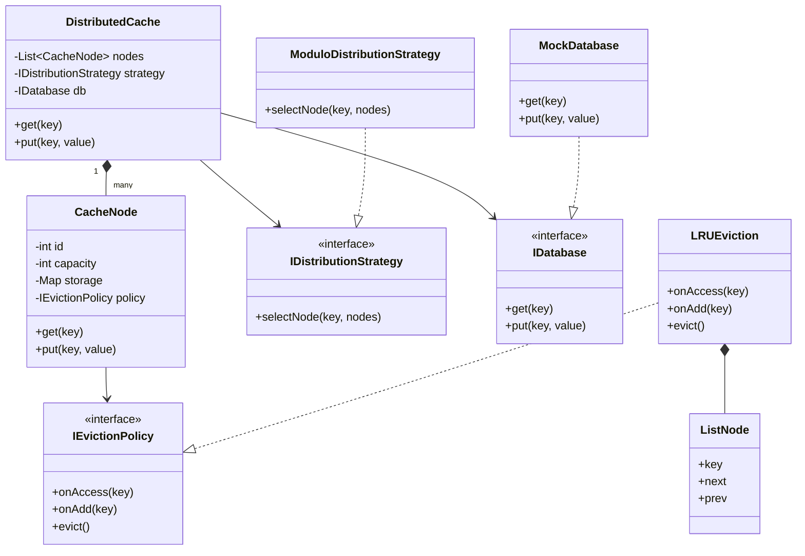

# Distributed Cache LLD

```mermaid
classDiagram
    class DistributedCache {
        -List~CacheNode~ nodes
        -IDistributionStrategy strategy
        -IDatabase db
        +get(key)
        +put(key, value)
    }
    class CacheNode {
        -int id
        -int capacity
        -Map storage
        -IEvictionPolicy policy
        +get(key)
        +put(key, value)
    }
    class IDistributionStrategy {
        <<interface>>
        +selectNode(key, nodes)
    }
    class IDatabase {
        <<interface>>
        +get(key)
        +put(key, value)
    }
    class IEvictionPolicy {
        <<interface>>
        +onAccess(key)
        +onAdd(key)
        +evict()
    }
    class ModuloDistributionStrategy {
        +selectNode(key, nodes)
    }
    class MockDatabase {
        +get(key)
        +put(key, value)
    }
    class LRUEviction {
        +onAccess(key)
        +onAdd(key)
        +evict()
    }
    class ListNode {
        +key
        +next
        +prev
    }

    DistributedCache "1" *-- "many" CacheNode
    DistributedCache --> IDistributionStrategy
    DistributedCache --> IDatabase
    CacheNode --> IEvictionPolicy
    ModuloDistributionStrategy ..|> IDistributionStrategy
    MockDatabase ..|> IDatabase
    LRUEviction ..|> IEvictionPolicy
    LRUEviction *-- ListNode
```
