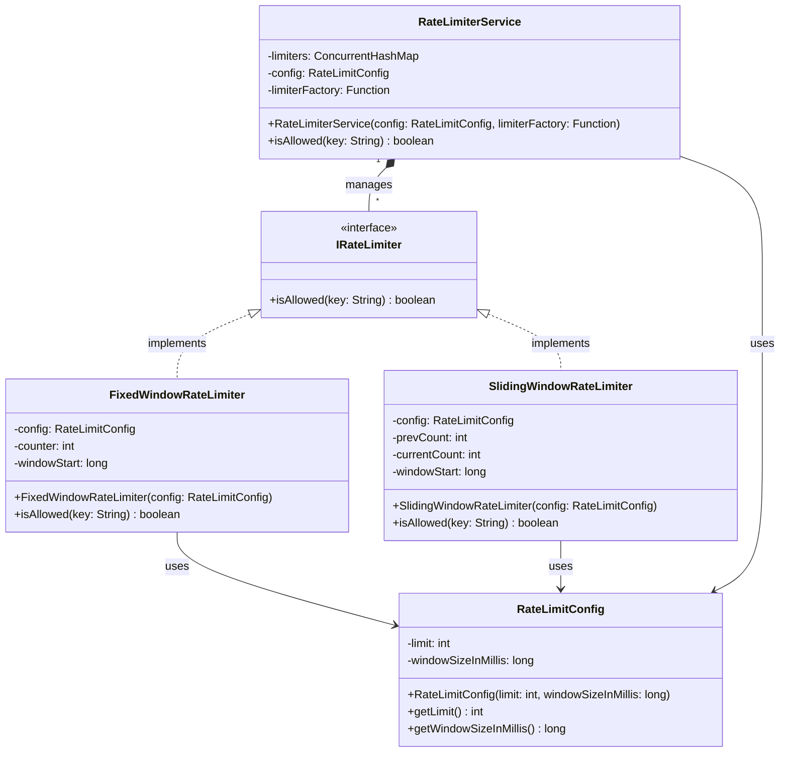

# Rate Limiting System

```mermaid
classDiagram
    class IRateLimiter {
        <<interface>>
        +isAllowed(key: String) boolean
    }

    class FixedWindowRateLimiter {
        -config: RateLimitConfig
        -counter: int
        -windowStart: long
        +FixedWindowRateLimiter(config: RateLimitConfig)
        +isAllowed(key: String) boolean
    }

    class SlidingWindowRateLimiter {
        -config: RateLimitConfig
        -prevCount: int
        -currentCount: int
        -windowStart: long
        +SlidingWindowRateLimiter(config: RateLimitConfig)
        +isAllowed(key: String) boolean
    }

    class RateLimitConfig {
        -limit: int
        -windowSizeInMillis: long
        +RateLimitConfig(limit: int, windowSizeInMillis: long)
        +getLimit() int
        +getWindowSizeInMillis() long
    }

    class RateLimiterService {
        -limiters: ConcurrentHashMap<String, IRateLimiter>
        -config: RateLimitConfig
        -limiterFactory: Function<RateLimitConfig, IRateLimiter>
        +RateLimiterService(config: RateLimitConfig, limiterFactory: Function)
        +isAllowed(key: String) boolean
    }

    IRateLimiter <|.. FixedWindowRateLimiter : implements
    IRateLimiter <|.. SlidingWindowRateLimiter : implements
    FixedWindowRateLimiter --> RateLimitConfig : uses
    SlidingWindowRateLimiter --> RateLimitConfig : uses
    RateLimiterService "1" *-- "*" IRateLimiter : manages
    RateLimiterService --> RateLimitConfig : uses
```
